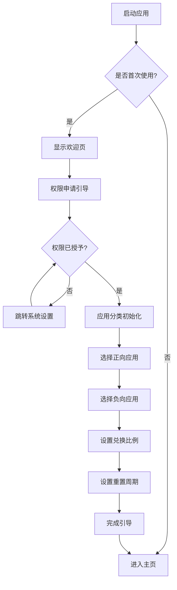
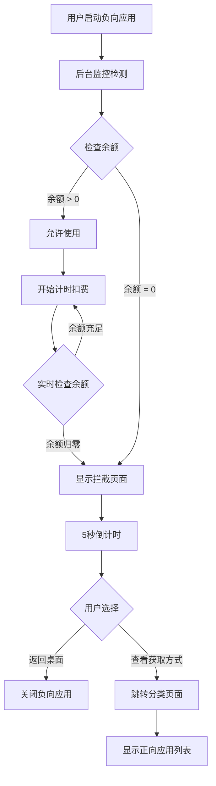
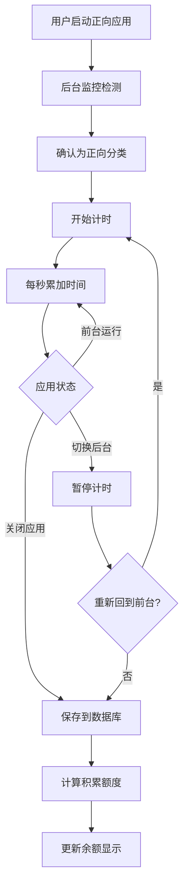

# 时间银行 - UI/UX设计规范

**文档版本：** v1.0  
**创建日期：** 2026-01-05  
**创建者：** Claude Code

---

## 1. 设计理念

### 1.1 核心原则
- **简洁克制：** 避免过度装饰，突出核心功能
- **正向激励：** 用视觉语言传递积极信号，而非负面压迫
- **数据可视：** 让时间消耗"看得见"，增强用户感知
- **防绕过设计：** 拦截页面不提供"妥协"选项

### 1.2 视觉风格
- **色彩系统：** 采用绿色（正向）+ 橙色（负向）双色体系
- **字体：** 系统默认字体，确保可读性
- **图标：** Material Design风格，统一视觉语言
- **布局：** 卡片式设计，信息层次清晰

---

## 2. 色彩规范

### 2.1 主色调
```
正向应用主题色
- 主色：#4CAF50（绿色，象征成长）
- 浅色：#81C784
- 深色：#388E3C

负向应用主题色
- 主色：#FF9800（橙色，象征警示）
- 浅色：#FFB74D
- 深色：#F57C00

中性色
- 背景色：#FAFAFA
- 卡片背景：#FFFFFF
- 文字主色：#212121
- 文字副色：#757575
- 分割线：#E0E0E0
```

### 2.2 功能色
```
- 成功/确认：#4CAF50
- 警告：#FFC107
- 错误/拦截：#F44336
- 信息提示：#2196F3
```

---

## 3. 页面结构与布局

### 3.1 页面导航架构

```
主应用
├── 主页（仪表板）
├── 应用分类管理
│   ├── 正向应用列表
│   └── 负向应用列表
├── 使用记录
│   ├── 今日统计
│   ├── 本周趋势
│   └── 应用排行
└── 设置
    ├── 兑换比例
    ├── 重置周期
    ├── 通知设置
    └── 关于

独立页面
├── 引导流程（首次启动）
└── 拦截页面（全屏覆盖）
```

### 3.2 底部导航栏
固定在底部，包含4个主要入口：

```
[主页图标]  [分类图标]  [记录图标]  [设置图标]
   主页        分类        记录        设置
```

---

## 4. 核心页面设计

### 4.1 主页（仪表板）

#### 布局结构
```
┌──────────────────────────────────┐
│  [顶部栏]                        │
│  时间银行  [?帮助]               │
├──────────────────────────────────┤
│  [时间余额卡片 - 醒目]          │
│  ┌────────────────────────────┐ │
│  │   ⏰ 当前余额              │ │
│  │                            │ │
│  │      2小时 35分钟          │ │
│  │   （大字号，绿色）         │ │
│  └────────────────────────────┘ │
├──────────────────────────────────┤
│  [今日统计对比卡片]             │
│  ┌──────────────┬──────────────┐ │
│  │ 正向应用     │ 负向应用     │ │
│  │ ✓ 3h 20m     │ ⚠ 1h 40m     │ │
│  │ (绿色背景)   │ (橙色背景)   │ │
│  └──────────────┴──────────────┘ │
├──────────────────────────────────┤
│  [快速操作]                     │
│  [查看详细记录] [管理应用分类]  │
├──────────────────────────────────┤
│  [本周进度预览 - 迷你图表]      │
│  周一 ━━  周二 ━━━  ...         │
└──────────────────────────────────┘
```

#### 交互说明
- 时间余额卡片：点击查看余额变化曲线
- 今日统计卡片：点击进入详细记录页
- 余额不足时，卡片显示红色边框+提示文字

---

### 4.2 应用分类管理页

#### 布局结构
```
┌──────────────────────────────────┐
│  [顶部栏]                        │
│  ← 应用分类  [搜索🔍]  [+添加]   │
├──────────────────────────────────┤
│  [标签切换]                      │
│  [正向应用]  [负向应用]  [未分类]│
├──────────────────────────────────┤
│  [应用列表 - 可拖拽]             │
│  ┌────────────────────────────┐ │
│  │ [图标] 微信读书            │ │
│  │        阅读 · 2.3h/周  [⋮] │ │
│  ├────────────────────────────┤ │
│  │ [图标] 网易云课堂          │ │
│  │        学习 · 1.8h/周  [⋮] │ │
│  ├────────────────────────────┤ │
│  │ [图标] 番茄TODO            │ │
│  │        效率 · 0.5h/周  [⋮] │ │
│  └────────────────────────────┘ │
├──────────────────────────────────┤
│  [提示信息]                      │
│  长按可拖动调整分类              │
└──────────────────────────────────┘
```

#### 交互说明
- 点击[⋮]菜单：移除分类 / 切换到负向 / 查看详情
- 拖拽应用到另一标签页：快速切换分类
- 点击[+添加]：从已安装应用中选择
- 搜索功能：支持拼音首字母搜索

---

### 4.3 使用记录页

#### 布局结构
```
┌──────────────────────────────────┐
│  [顶部栏]                        │
│  ← 使用记录  [日期选择器]        │
├──────────────────────────────────┤
│  [时间范围切换]                  │
│  [今日]  [本周]  [自定义]        │
├──────────────────────────────────┤
│  [数据总览卡片]                  │
│  ┌────────────────────────────┐ │
│  │ 本周总计                   │ │
│  │ 正向 18h ━━━━━━━━ 72%     │ │
│  │ 负向  7h ━━━━       28%    │ │
│  └────────────────────────────┘ │
├──────────────────────────────────┤
│  [趋势图表 - 柱状图/折线图]     │
│  ┌────────────────────────────┐ │
│  │    ┃                       │ │
│  │  ┃ ┃   ┃                   │ │
│  │  ┃ ┃ ┃ ┃   ┃               │ │
│  │ ━━━━━━━━━━━━━━━━━         │ │
│  │ 一 二 三 四 五 六 日        │ │
│  │ [绿色] 正向 [橙色] 负向    │ │
│  └────────────────────────────┘ │
├──────────────────────────────────┤
│  [应用使用排行]                  │
│  1. 微信读书    3h 20m  ━━━━━  │
│  2. 抖音        2h 15m  ━━━━    │
│  3. 网易云课堂  1h 50m  ━━━     │
│  ...                             │
└──────────────────────────────────┘
```

#### 数据展示规则
- 默认显示本周数据（周一至今）
- 支持切换查看单日、本周、自定义时间段
- 图表可左右滑动查看历史数据
- 点击应用名称：查看该应用的详细使用记录

---

### 4.4 设置页

#### 布局结构
```
┌──────────────────────────────────┐
│  [顶部栏]                        │
│  ← 设置                          │
├──────────────────────────────────┤
│  [基础设置分组]                  │
│  ┌────────────────────────────┐ │
│  │ 兑换比例                   │ │
│  │ 1:0.8  [调节滑块]  [编辑] │ │
│  ├────────────────────────────┤ │
│  │ 重置周期                   │ │
│  │ 每周一 00:00       [修改] │ │
│  ├────────────────────────────┤ │
│  │ 手动重置数据               │ │
│  │ 本周已重置 0 次    [重置] │ │
│  └────────────────────────────┘ │
├──────────────────────────────────┤
│  [通知设置分组]                  │
│  ┌────────────────────────────┐ │
│  │ 余额不足提醒       [开关] │ │
│  │ 重置提醒           [开关] │ │
│  │ 每日总结报告       [开关] │ │
│  └────────────────────────────┘ │
├──────────────────────────────────┤
│  [高级设置分组]                  │
│  ┌────────────────────────────┐ │
│  │ 监控服务状态       [运行中]│ │
│  │ 数据导出           [导出]  │ │
│  │ 清空所有数据       [清空]  │ │
│  └────────────────────────────┘ │
├──────────────────────────────────┤
│  [关于分组]                      │
│  ┌────────────────────────────┐ │
│  │ 使用帮助           [查看]  │ │
│  │ 隐私政策           [查看]  │ │
│  │ 版本信息           v1.0    │ │
│  └────────────────────────────┘ │
└──────────────────────────────────┘
```

#### 交互说明
- 兑换比例：支持拖动滑块或输入数值（0.1-1.0）
- 重置周期：弹出日期时间选择器
- 手动重置：需二次确认，每周仅限1次
- 数据导出：生成CSV文件到Downloads目录

---

### 4.5 拦截页面（全屏）

#### 布局结构
```
┌──────────────────────────────────┐
│                                  │
│         [大图标 🚫]              │
│                                  │
│      时间余额已用完              │
│                                  │
│      当前余额: 0分钟             │
│                                  │
│  ┌────────────────────────────┐ │
│  │  今日正向应用使用时长      │ │
│  │        1小时 20分钟        │ │
│  └────────────────────────────┘ │
│                                  │
│    "再坚持一下，你可以的！"      │
│                                  │
│  ┌────────────────────────────┐ │
│  │ [按钮] 返回桌面            │ │
│  └────────────────────────────┘ │
│  ┌────────────────────────────┐ │
│  │ [按钮] 查看如何获取时间    │ │
│  └────────────────────────────┘ │
│                                  │
│  （禁用返回键和Home键）          │
│  （5秒后允许返回桌面）           │
└──────────────────────────────────┘
```

#### 设计要点
- **全屏显示：** 覆盖目标应用，无法轻易关闭
- **延迟退出：** 显示5秒后才允许返回桌面（防止条件反射点击）
- **无妥协选项：** 不提供"再玩5分钟"等诱导按钮
- **激励文案：** 使用正向鼓励语言，避免负面指责
- **视觉冲击：** 使用红色系，强化"停止"信号

---

### 4.6 引导流程页面

#### 页面1：欢迎页
```
┌──────────────────────────────────┐
│                                  │
│         [应用Logo]               │
│                                  │
│         时间银行                 │
│                                  │
│    让时间更有价值                │
│                                  │
│  [插图：天平/时钟图案]           │
│                                  │
│                                  │
│  ┌────────────────────────────┐ │
│  │ [按钮] 开始使用            │ │
│  └────────────────────────────┘ │
│                                  │
│  ●○○○ (进度指示器)              │
└──────────────────────────────────┘
```

#### 页面2：权限申请
```
┌──────────────────────────────────┐
│  [图标 🔑]                       │
│                                  │
│  需要开启权限                    │
│                                  │
│  为了统计应用使用时长，          │
│  我们需要"使用情况访问权限"      │
│                                  │
│  [说明卡片]                      │
│  ✓ 不会上传数据到服务器          │
│  ✓ 仅在本地统计时长              │
│  ✓ 不会读取应用内容              │
│                                  │
│  ┌────────────────────────────┐ │
│  │ [按钮] 前往设置开启权限    │ │
│  └────────────────────────────┘ │
│                                  │
│  ○●○○ (进度指示器)              │
└──────────────────────────────────┘
```

#### 页面3：应用分类初始化
```
┌──────────────────────────────────┐
│  设置应用分类                    │
│                                  │
│  [提示] 请选择正向和负向应用     │
│                                  │
│  [正向应用推荐列表]              │
│  ☐ 微信读书  ☐ 网易云课堂        │
│  ☐ 得到      ☐ 扇贝单词          │
│                                  │
│  [负向应用推荐列表]              │
│  ☐ 抖音      ☐ 王者荣耀          │
│  ☐ 微博      ☐ 快手              │
│                                  │
│  [+ 手动添加更多应用]            │
│                                  │
│  ┌────────────────────────────┐ │
│  │ [按钮] 下一步              │ │
│  └────────────────────────────┘ │
│                                  │
│  ○○●○ (进度指示器)              │
└──────────────────────────────────┘
```

#### 页面4：规则设定
```
┌──────────────────────────────────┐
│  设置兑换规则                    │
│                                  │
│  [说明卡片]                      │
│  使用正向应用可以积累时间，      │
│  用于解锁负向应用的使用权        │
│                                  │
│  兑换比例设置                    │
│  ┌────────────────────────────┐ │
│  │ 1 : [0.8]                  │ │
│  │ ├───●──────┤ (滑块)        │ │
│  │                            │ │
│  │ 使用2分钟正向app            │
│  │ = 获得1.6分钟负向app使用权  │ │
│  └────────────────────────────┘ │
│                                  │
│  重置周期设置                    │
│  每 [周一] [00:00] 重置         │
│                                  │
│  ┌────────────────────────────┐ │
│  │ [按钮] 完成设置，开始使用  │ │
│  └────────────────────────────┘ │
│                                  │
│  ○○○● (进度指示器)              │
└──────────────────────────────────┘
```

---

## 5. 交互流程图

### 5.1 首次启动流程



### 5.2 应用拦截流程



### 5.3 时间积累流程



---

## 6. 组件设计规范

### 6.1 按钮组件

#### 主按钮（Primary Button）
- 高度：48dp
- 圆角：8dp
- 颜色：正向操作使用#4CAF50，负向操作使用#FF9800
- 文字：16sp，白色
- 点击效果：20%透明度叠加

#### 次按钮（Secondary Button）
- 高度：44dp
- 边框：1dp，颜色同主按钮
- 背景：透明
- 文字：16sp，颜色同边框
- 点击效果：10%背景填充

### 6.2 卡片组件
- 背景：#FFFFFF
- 圆角：12dp
- 阴影：elevation 2dp
- 内边距：16dp
- 卡片间距：12dp

### 6.3 输入框组件
- 高度：56dp
- 边框：1dp #E0E0E0
- 圆角：8dp
- 聚焦时边框：2dp #4CAF50
- 提示文字：14sp #757575
- 输入文字：16sp #212121

### 6.4 开关组件
- 使用Material Design Switch
- 开启状态：#4CAF50
- 关闭状态：#BDBDBD

---

## 7. 图标系统

### 7.1 导航图标
- 主页：`home` (Material Icons)
- 分类：`category`
- 记录：`bar_chart`
- 设置：`settings`

### 7.2 功能图标
- 正向应用：`check_circle` (绿色)
- 负向应用：`warning` (橙色)
- 添加：`add_circle`
- 搜索：`search`
- 菜单：`more_vert`
- 时间：`schedule`
- 拦截：`block`

### 7.3 图标规范
- 尺寸：24dp x 24dp
- 颜色：#757575（默认）、#212121（激活）
- 风格：Material Design Filled

---

## 8. 动画与反馈

### 8.1 页面转场
- 主页面切换：淡入淡出（300ms）
- 弹窗显示：从底部滑入（250ms）
- 列表加载：骨架屏占位

### 8.2 交互反馈
- 按钮点击：涟漪效果 + 轻微缩放
- 数值变化：数字滚动动画（500ms）
- 余额不足：卡片抖动动画
- 数据更新：加载指示器

### 8.3 微交互
- 余额增加：绿色向上箭头 + "+5min"提示
- 余额减少：橙色向下箭头 + "-5min"提示
- 拦截触发：震动反馈 + 提示音（可关闭）

---

## 9. 响应式适配

### 9.1 屏幕尺寸支持
- 最小宽度：320dp（小屏手机）
- 最大宽度：600dp（平板使用双栏布局）
- 推荐尺寸：360dp - 420dp（主流手机）

### 9.2 布局适配规则
- 使用ConstraintLayout实现灵活布局
- 文字大小使用sp，布局尺寸使用dp
- 关键元素（按钮、卡片）保持固定最小尺寸
- 列表内容可滚动，避免内容溢出

### 9.3 横屏适配
- 主页：保持竖屏布局，居中显示
- 拦截页面：强制竖屏，避免用户通过旋转绕过

---

## 10. 可访问性设计

### 10.1 无障碍支持
- 所有交互元素提供contentDescription
- 最小点击区域：48dp x 48dp
- 颜色对比度 ≥ 4.5:1（文字与背景）
- 支持TalkBack屏幕阅读器

### 10.2 字体大小
- 支持系统字体缩放（0.85x - 1.3x）
- 关键数据（余额）使用大字号，不随系统缩放过度变化

---

## 11. 暗色模式（可选）

### 11.1 暗色主题色彩
```
背景色：#121212
卡片背景：#1E1E1E
文字主色：#FFFFFF
文字副色：#B0B0B0
分割线：#2C2C2C

正向主题色：#66BB6A（稍浅）
负向主题色：#FFA726（稍浅）
```

### 11.2 暗色模式切换
- 跟随系统设置自动切换
- 设置页面提供手动切换选项：自动/浅色/深色

---

## 12. 设计资源清单

### 12.1 需要准备的资源
- [ ] 应用图标（圆形、圆角方形）
- [ ] 启动页背景
- [ ] 引导页插图（4张）
- [ ] 空状态插图（无数据时显示）
- [ ] 拦截页面背景图
- [ ] 应用分类默认图标
- [ ] 通知栏图标

### 12.2 设计交付物
- [ ] Figma/Sketch设计文件
- [ ] 切图资源（@1x, @2x, @3x）
- [ ] 色彩代码表（colors.xml）
- [ ] 尺寸规范表（dimens.xml）
- [ ] 字体样式表（styles.xml）

---

## 13. 附录

### 13.1 参考设计
- Google Digital Wellbeing（时间管理参考）
- Forest专注森林（激励机制参考）
- Apple Screen Time（数据可视化参考）

### 13.2 设计工具
- **原型设计：** Figma / Adobe XD
- **图标库：** Material Design Icons
- **配色工具：** Material Color Tool
- **图表库：** MPAndroidChart

### 13.3 文档变更历史
| 版本 | 日期 | 修改内容 | 修改人 |
|------|------|----------|--------|
| v1.0 | 2026-01-05 | 初始版本创建 | Claude Code |

---

**文档结束**
